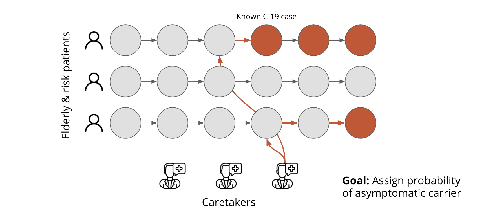
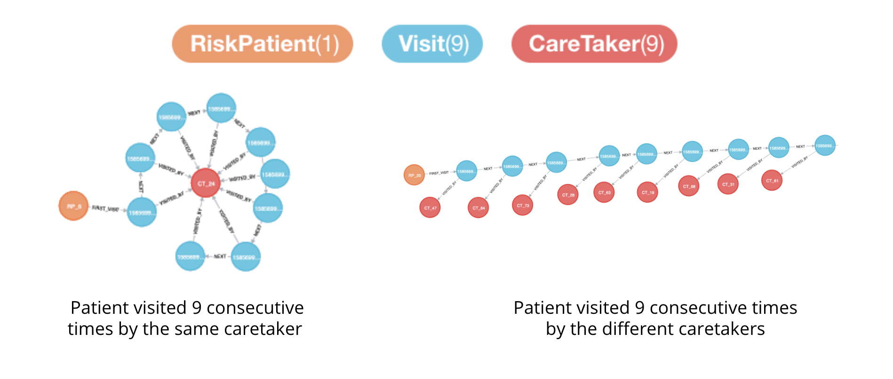

# Asymptomatic Covid-19 Tracking

## Background
More than 1/3 of the retirement homes in Sweden report Covid-19, despite having strict visit restrictions and health controls of employees.
The objective of this project is to identify asymptomatic Covid-19 carriers among employees in retirement homes quicker and more accurate.

## Solution
We find inspration from fraud detection of skimmed credit cards.
The analogies are

| Credit card fraud   |  Covid tracking  |
|:---|:---|
| Credit card transactions  |  Patient visits         |
| Fraudulent transactions   |  Infected patients      |
| Skimmed terminals         |  Asymptomatic carriers  |

### Inputs:
1. Visit logs 
2. Infected risk patients / elderly

### Output(s):
1. Ranking of most probable asymptomatic carriers among caretakers 
2. *Probability of future infected patients*

## Screenshots
Check out the detailed project decription, illustrations and screenshots in the shared [pdf here](covid-tracking.pdf).

### Illustration of the search algorithm
 </img>

### Data model from simulations
 </img>

## Next steps & Contributions
1) **Live trials and feedback:**  We are in need of conducting real searches on real data. Please contact mz@predli.com if interested.  
2) **Algorithm and data model improvements:** TBD 
3) **Tech improvements:** TBD

